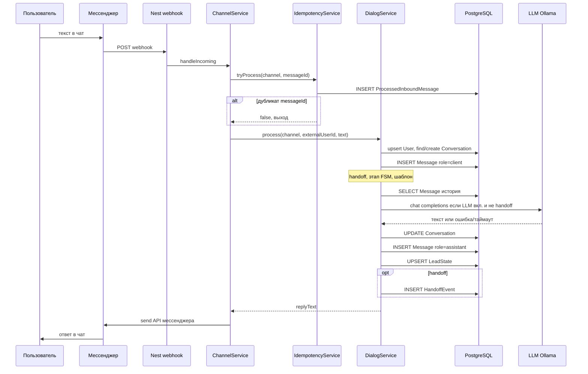

# Алгоритм работы бота (Telegram / WhatsApp)

От **сообщения пользователя в мессенджере** до **ответа в том же чате**: цепочка вызовов, роль PostgreSQL и файлов конфигурации.

---

## Диаграмма последовательности

Для **Telegram**: `ChannelService` = `TelegramService`, webhook `POST /webhooks/telegram`.  
Для **WhatsApp**: `WhatsAppService`, `POST /webhooks/whatsapp` (плюс верификация GET и при необходимости подпись).

---

## Этапы по шагам

### 1. Доставка в приложение

Мессенджер отправляет **HTTP POST** на публичный URL вебхука. Контроллер передаёт тело в сервис канала (`handleIncoming`).

### 2. Извлечение сообщения

Из payload берутся текст, идентификатор пользователя в канале (например Telegram `chat.id` или WhatsApp `from`) и при наличии **id сообщения**. Некорректные апдейты отбрасываются.

### 3. Идемпотентность (БД)

`IdempotencyService.tryProcess(channel, externalMessageId)`:

- Вставка строки в **`ProcessedInboundMessage`** с уникальной парой `(channel, externalMessageId)`.
- Повтор той же пары → нарушение уникальности → **обработка не выполняется** (защита от повторной доставки webhook).

Если `messageId` нет, повторная защита по этой таблице не срабатывает (обработка идёт каждый раз).

### 4. Пользователь и активный диалог (БД)

`DialogService.process`:

1. **`User`** — `upsert` по `(channel, externalId)`: один пользователь на пару канал + внешний id.
2. **`Conversation`** — поиск последней беседы со статусом **`ACTIVE`** для этого пользователя. Если нет — создаётся новая. Так задаётся «текущий» диалог.

### 5. Сохранение входящего сообщения (БД)

В **`Message`** создаётся запись: `role = "client"`, текст, `conversationId`.

### 6. Правила без LLM (файл на диске)

Используется **`scripts/sales-scripts.json`**:

- **Handoff**: если текст совпал с `handoff.rules` → причина handoff, ответ из `handoff.replyLines`, **LLM не вызывается**.
- Иначе **этап воронки** (`stage`): правила `rules` (подстроки → `setStage`) и логика перехода с дефолтного этапа (например на `qualification`).
- Формируется **шаблонный ответ** для этапа — используется как текст ответа при отключённом LLM, ошибке или таймауте.

### 7. Генерация ответа: LLM или шаблон

Если **не handoff** и LLM включён (`LLM_ENABLED`):

- Из **`Message`** читается хвост истории беседы (лимит **`LLM_CONTEXT_MESSAGES`**, иначе до 16 сообщений).
- Системный промпт строится из профиля **`config/prompt-profiles/<LLM_PROMPT_PROFILE>.json`** (`PromptProfileService`).
- Запрос к провайдеру OpenAI-совместимого API (по умолчанию **Ollama**). С **`LLM_TIMEOUT_MS`** запрос может оборваться → тогда используется **шаблон** из п.6.

При handoff или выключенном / неуспешном LLM итоговый текст — шаблон или текст handoff.

### 8. Фиксация состояния и исходящего сообщения (БД)

- **`Conversation`**: обновляются `stage`, при handoff — `status = HANDED_OFF`, иначе остаётся `ACTIVE`.
- **`Message`**: новая строка с `role = "assistant"` и итоговым текстом.
- **`LeadState`**: `upsert` — в т.ч. `need` (последний текст пользователя), `nextAction` из конфига или handoff.

При handoff дополнительно **`HandoffEvent`**: `conversationId`, `reason`.

### 9. Отправка в мессенджер

Сервис канала вызывает HTTP API мессенджера (Telegram `sendMessage`, WhatsApp Cloud API `messages`). Пользователь видит ответ в чате.

---

## Таблицы PostgreSQL (кратко)

| Таблица | Назначение |
|---------|------------|
| **User** | Участник чата: `channel` + `externalId`. |
| **Conversation** | Диалог: `stage`, `status` (`ACTIVE` / `HANDED_OFF` / `CLOSED`). |
| **Message** | История: роли `client` / `assistant`. |
| **LeadState** | Сводка по лиду: `need`, `nextAction`, поля бюджета/сроков в схеме. |
| **HandoffEvent** | Журнал передачи запроса человеку. |
| **ProcessedInboundMessage** | Идемпотентность входящих по `(channel, externalMessageId)`. |

---

## Что хранится не в БД

| Ресурс | Назначение |
|--------|------------|
| `scripts/sales-scripts.json` | Этапы, шаблоны реплик, правила переходов и handoff. |
| `config/prompt-profiles/*.json` | Компания, рамка темы, запреты, опциональный `scopeFile`. |
| Ollama / внешний LLM | Инференс; параметры — переменные окружения (`LLM_*`). |

---

## Связанный код (ориентиры)

- Webhook Telegram: `src/modules/telegram/telegram.controller.ts`, `telegram.service.ts`
- Webhook WhatsApp: `src/modules/whatsapp/whatsapp.controller.ts`, `whatsapp.service.ts`
- Диалог и БД: `src/modules/dialog/dialog.service.ts`
- Идемпотентность: `src/modules/idempotency/idempotency.service.ts`
- LLM: `src/modules/llm/llm.service.ts`
- Профиль промпта: `src/modules/prompt-profile/prompt-profile.service.ts`
- Схема БД: `prisma/schema.prisma`
